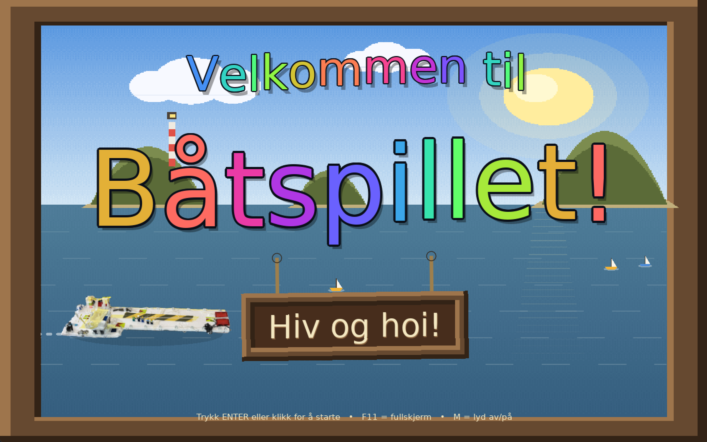

# Båtspillet 🚤



Et båtspill jeg har laget til gutten min, Finn-Erik (5). Du seiler rundt mellom 
byer, frakter passasjerer og annen last og tjener gullmynter.

## Start spillet

Last ned **Båtspillet.dmg** fra [Releases](https://github.com/tk512/fespill/releases),
åpne den og dra spillet over i Applications-katalogen. (LÖVE er pakket inne i appen –
du trenger ikke installere noe ekstra.)

Spillet er ikke signert hos Apple, så macOS blokkerer det første gang. Enkleste
fiks – åpne **Terminal**, lim inn og trykk Enter:

```
xattr -dr com.apple.quarantine "/Applications/Båtspillet.app"
```

(Alternativt: dobbeltklikk appen så den feiler, gå til **Systeminnstillinger →
Personvern og sikkerhet**, bla ned og klikk **«Åpne likevel»**. På nyere macOS
funker ikke alltid den knappen – da er Terminal-linja over tryggest.)

Eller bare kjør `.love`-fila direkte hvis du har LÖVE installert.

## Kontroller

| Knapp | Hva|
|-------|-----------|
| Klikk på vannet | Båten seiler dit |
| Piltaster / WASD | Styr båten selv |
| Mus mot kanten, eller høyreklikk + dra | Flytt kartet |
| C | Sentrer kameraet på båten |
| M | Lyd av/på |
| ESC | Tilbake til menyen |

## Sånn spiller du

Seil bort til en havn, så legger båten til av seg 
selv. Havnesjefen gir deg et oppdrag ... kanskje 
noen passasjerer, fisk osv. En pil over båten 
viser hvilken by du skal til.

## ⚠️ Sjørøvere.... HIV OG HOI!

Av og til, når du har gull om bord, dukker det opp et svart sjørøverskip som jager deg. 
